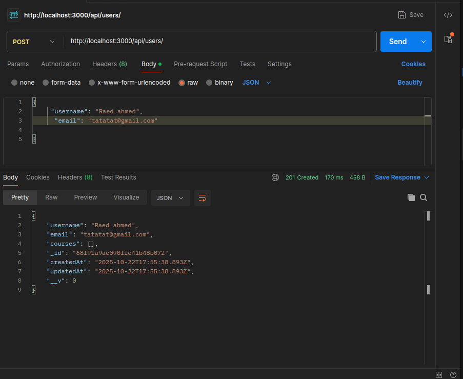

# EduPlatform API

A RESTful API for an educational platform built with the MERN stack (MongoDB, Express.js, React - backend only). This backend provides endpoints for managing users, courses, profiles, and reviews, including user enrollment in courses and course reviews.

## Features

- **User Management**: Create, retrieve, and manage user accounts.
- **Course Management**: Create courses, enroll users, and list enrolled students.
- **Profiles**: One-to-one user profiles with bio and website.
- **Reviews**: Add and retrieve reviews for courses with ratings (1-5).
- **Error Handling**: Centralized error handling middleware.
- **CORS Support**: Enabled for cross-origin requests.

## Tech Stack

- **Backend**: Node.js, Express.js
- **Database**: MongoDB with Mongoose ODM
- **Other**: CORS, dotenv for environment variables, Nodemon for development

## Prerequisites

- Node.js (v14 or higher)
- MongoDB (local or cloud instance like MongoDB Atlas)
- npm 

## Installation

1. Clone the repository:
   ```bash
   git clone https://github.com/your-username/eduplatform-api.git
   cd eduplatform-api
   ```

2. Install dependencies:
   ```bash
   npm install
   ```

3. Create a `.env` file in the root directory and add your environment variables:
   ```
   MONGODB_URI=mongodb://localhost:27017/eduplatform
   PORT=3000
   ```

4. Start the server:
   - Development mode: `npm run dev`
   - Production mode: `npm start`

The server will run on `http://localhost:3000` by default.

## Usage

The API provides endpoints under `/api/users` and `/api/courses`. Use tools like Postman or curl to interact with the API.

### API Endpoints

#### Users
- `POST /api/users` - Create a new user
- `GET /api/users` - Get all users
- `GET /api/users/:id` - Get user by ID
- `GET /api/users/:userId/courses` - Get courses for a user

#### Profiles
- `POST /api/users/:userId/profile` - Create a profile for a user
- `GET /api/users/:userId/profile` - Get user profile
- `PUT /api/users/:userId/profile` - Update user profile

#### Courses
- `POST /api/courses` - Create a new course
- `GET /api/courses` - Get all courses
- `GET /api/courses/:id` - Get course by ID
- `POST /api/courses/:courseId/enroll/:userId` - Enroll a user in a course
- `GET /api/courses/:courseId/students` - Get students enrolled in a course

#### Reviews
- `POST /api/courses/:courseId/reviews` - Add a review to a course
- `GET /api/courses/:courseId/reviews` - Get reviews for a course

### Example Requests

- Create a user:
  ```json
  POST /api/users
  {
    "username": "john_doe",
    "email": "john@example.com"
  }
  ```
  

- Create a course:
  ```json
  POST /api/courses
  {
    "title": "Introduction to JavaScript",
    "description": "Learn the basics of JavaScript",
    "instructor": "Jane Smith"
  }
  ```
  

- Add a review:
  ```json
  POST /api/courses/:courseId/reviews
  {
    "rating": 5,
    "comment": "Great course!",
    "user": "userId"
  }
  ```
  

- Get all users:
  ```
  GET /api/users
  ```
  

- Get user by ID:
  ```
  GET /api/users/:id
  ```
  

- Get all courses:
  ```
  GET /api/courses
  ```
  

- Get course by ID:
  ```
  GET /api/courses/:id
  ```
  

- Get students enrolled in a course:
  ```
  GET /api/courses/:courseId/students
  ```
  

- Get reviews for a course:
  ```
  GET /api/courses/:courseId/reviews
  ```
  

## Project Structure

```
eduplatform/
├── config/
│   └── db.js              # Database connection
├── controllers/
│   ├── userController.js
│   ├── profileController.js
│   ├── courseController.js
│   └── reviewController.js
├── models/
│   ├── User.js
│   ├── Profile.js
│   ├── Course.js
│   └── Review.js
├── routes/
│   ├── userRoutes.js
│   └── courseRoutes.js
├── server.js              # Main server file
├── package.json
└── README.md
```

## Environment Variables

- `MONGODB_URI`: MongoDB connection string
- `PORT`: Server port (default: 3000)

## Scripts

- `npm start`: Start the server in production mode
- `npm run dev`: Start the server in development mode with Nodemon

## Contributing

1. Fork the repository
2. Create a feature branch: `git checkout -b feature/your-feature`
3. Commit changes: `git commit -m 'Add some feature'`
4. Push to the branch: `git push origin feature/your-feature`
5. Open a pull request

## License

This project is licensed under the ISC License.

